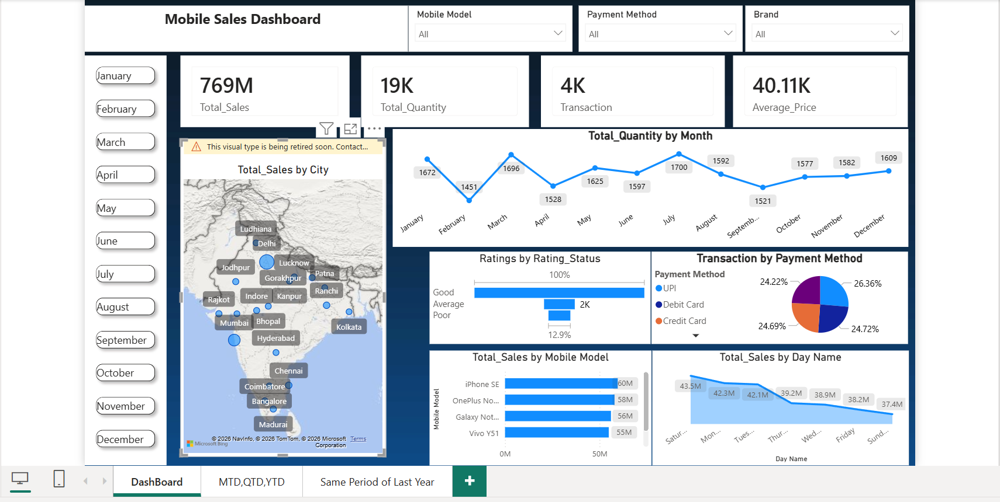
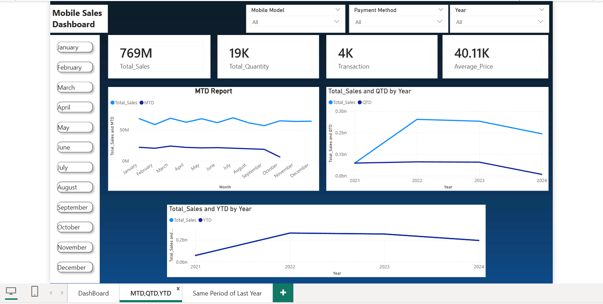
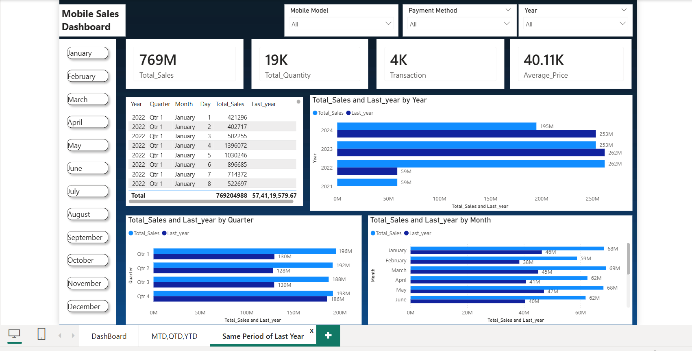

<!DOCTYPE html>
<html lang="en">
<head>
<meta charset="UTF-8"/>
<meta name="viewport" content="width=device-width, initial-scale=1.0"/>
<title>Mobile Sales Dashboard — Project README</title>
<link href="https://fonts.googleapis.com/css2?family=Syne:wght@400;600;700;800&family=DM+Sans:ital,wght@0,300;0,400;0,500;1,300&display=swap" rel="stylesheet"/>

</head>
<body>

<!-- ── HERO ── -->
<section class="hero">
  Power BI · SQL · Data Analytics
  <h1>Mobile Sales Dashboard</h1>
  
An end-to-end interactive analytics solution tracking mobile sales across cities, models, and time — built with Power BI and real-world data.

  

    
 Ojas Paul

    
 January 2026

    
 3 Dashboard Pages

    
 769M Total Sales

  

  

    

    scroll
  

</section>

<!-- ── KPI STRIP ── -->

  

    
769M

    
Total Sales

  

  

    
19K

    
Total Quantity

  

  

    
4K

    
Transactions

  

  

    
40.1K

    
Avg. Price

  

<!-- ── DASHBOARD SCREENSHOTS ── -->
<section class="section">
  

    01
    <h2 class="section-title">Dashboard Pages</h2>
  

  

    

      <button class="viewer-tab active" onclick="switchTab(0)">Main Dashboard</button>
      <button class="viewer-tab" onclick="switchTab(1)">MTD · QTD · YTD</button>
      <button class="viewer-tab" onclick="switchTab(2)">Same Period Last Year</button>
    

    

      
      

        <strong>Main Dashboard</strong> — Overview of total sales by city (map), quantity trends by month (line chart), transaction breakdown by payment method (pie), top-performing mobile models, and weekday sales distribution. Features slicers for Mobile Model, Payment Method, and Brand.
      

    

    

      
      

        <strong>MTD · QTD · YTD Report</strong> — Time-intelligence analysis using DAX measures. MTD (Month-to-Date) report tracks monthly rolling performance; QTD and YTD line charts reveal growth trajectories from 2021 to 2024, showing peak performance in 2022–2023 and slight moderation in 2024.
      

    

    

      
      

        <strong>Same Period Last Year</strong> — Year-over-year comparison across Year, Quarter, and Month views. Side-by-side bar charts clearly visualize current vs. prior year performance, enabling quick identification of growth and decline periods.
      

    

  

</section>

<!-- ── FEATURES ── -->
<section class="section">
  

    02
    <h2 class="section-title">Key Features</h2>
  

  

    

      🗺️
      
Geo Sales Map

      
Interactive Bing map visualizing Total Sales by City across India — from Ludhiana to Madurai — with bubble sizing by revenue volume.

    

    

      📅
      
Time Intelligence

      
DAX-powered MTD, QTD, and YTD calculations with dynamic slicers for Month, Year, Mobile Model, and Payment Method.

    

    

      📊
      
YoY Comparison

      
Side-by-side current vs. same period last year analysis at Year, Quarter, and Month granularity using time-intelligence DAX measures.

    

    

      💳
      
Payment Analytics

      
Transaction distribution across UPI (26.36%), Credit Card (24.72%), Debit Card (24.69%), and other payment methods via donut chart.

    

    

      ⭐
      
Rating Analysis

      
Customer rating segmentation (Good / Average / Poor) with percentage breakdowns, showing strong skew toward positive reviews.

    

    

      📱
      
Model Performance

      
Top mobile models ranked by revenue — iPhone SE (60M), OnePlus Nord (58M), Samsung Galaxy Note (56M), Vivo Y51 (55M).

    

  

</section>

<!-- ── DATA INSIGHTS ── -->
<section class="section">
  

    03
    <h2 class="section-title">Data Insights</h2>
  

  

    

      
Top Models by Revenue

      

        

iPhone SE

60M

        

OnePlus Nord

58M

        

Galaxy Note

56M

        

Vivo Y51

55M

      

    

    

      
Payment Method Split

      <ul class="insight-list">
        <li>UPI <strong>26.36%</strong></li>
        <li>Credit Card <strong>24.72%</strong></li>
        <li>Debit Card <strong>24.69%</strong></li>
        <li>Other Methods <strong>24.22%</strong></li>
      </ul>
    

    

      
Sales by Day of Week

      <ul class="insight-list">
        <li>Saturday <strong>43.5M</strong></li>
        <li>Monday <strong>42.3M</strong></li>
        <li>Tuesday <strong>42.1M</strong></li>
        <li>Thursday <strong>39.2M</strong></li>
        <li>Wednesday <strong>38.9M</strong></li>
        <li>Friday <strong>38.2M</strong></li>
        <li>Sunday <strong>37.4M</strong></li>
      </ul>
    

    

      
YoY Sales Growth

      <ul class="insight-list">
        <li>2021 <strong>~59M</strong></li>
        <li>2022 <strong>~262M (+344%)</strong></li>
        <li>2023 <strong>~253M (−3.4%)</strong></li>
        <li>2024 <strong>~195M (−23%)</strong></li>
      </ul>
    

  

</section>

<!-- ── TECH STACK ── -->
<section class="section" style="padding-top: 80px; padding-bottom: 80px;">
  

    04
    <h2 class="section-title">Tech Stack</h2>
  

  

    Power BI Desktop
    DAX
    Microsoft Excel (.xlsx)
    SQL
    Bing Maps Visual
    Time-Intelligence Functions
    Donut / Bar / Line Charts
    Power Query
    Interactive Slicers
  

</section>

<!-- ── FOOTER ── -->
<footer class="footer">
  

    
Ojas Paul

    
Data Analyst · KIIT University, Bhubaneswar

  

  

    <a class="footer-link" href="mailto:ojaspaul123@gmail.com">ojaspaul123@gmail.com</a>
    <a class="footer-link" href="https://www.linkedin.com/in/ojas-paul-324aa5337/">LinkedIn</a>
  

</footer>

</body>
</html>
